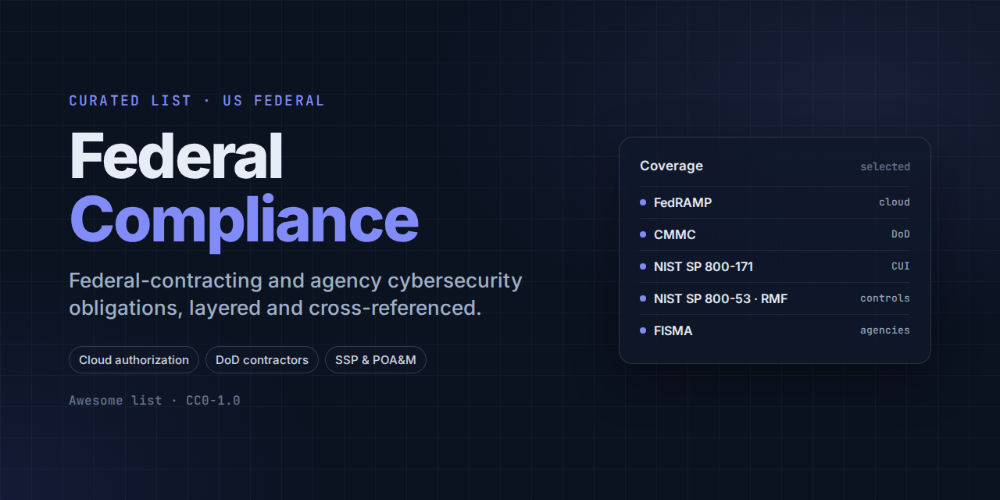

# Federal Compliance

A curated list of statutes, regulations, control catalogs, and tooling for **US federal-contracting and federal-agency cybersecurity compliance** — the layered set of obligations that govern any organization building, hosting, or selling technology to the federal government.

**Scope:** Anything that materially helps a practitioner scope, implement, assess, or authorize against US federal cybersecurity compliance obligations — cloud authorization programs, DoD contractor requirements, the federal-agency risk management framework, statutory and contractual baselines, and sector-specific safeguarding rules. NIST CSF, ISO/IEC 27001, and PCI-DSS sit outside this list's scope and are covered by the companion [Security Frameworks](https://github.com/garynair/security-frameworks) list; COBIT, COSO, and SOX/ITGC/ITAC by the companion [IT Audit & Controls](https://github.com/garynair/it-audit-controls) list. One deliberate exception: NIST SP 800-53 and SP 800-37 (the Risk Management Framework control catalog) *are* covered here, even though NIST CSF is not — see "Why These Frameworks Matter" below for why. ITAR and EAR (export control) are a distinct trade-compliance practice area and are excluded entirely.

**Why now:** Several pillars of this landscape hit hard, dated transitions right around this list's publication. FedRAMP itself is mid-migration under its Consolidated Rules for 2026: "FedRAMP Authorization" terminology has given way to "FedRAMP Certification" and Impact Levels to Classes A–D, legacy Rev5 baselines are now archived as reference-only, Rev5 submissions closed to new entrants on 28 July 2026, and the new rules become mandatory for all stakeholders on 1 January 2027. Separately, NIST's cryptographic-module transition reaches a hard deadline this week: FIPS 140-2 validated modules can be used for new federal systems only through 21 September 2026, after which they move to the Cryptographic Module Validation Program's Historical list for existing-system use only. StateRAMP itself has rebranded to GovRAMP. CMMC's own rollout has shifted more than once since its 32 CFR Part 170 final rule took effect on 16 December 2024, so treat any specific CMMC phase-in date you read elsewhere as provisional and verify it against the current DFARS clause text. And OMB rescinded its standardized software-attestation regime (M-22-18/M-23-16) in January 2026 via M-26-05, moving agencies to a risk-based approach even as EO 14028's underlying zero-trust and SBOM mandates continue to apply. NIST also finalized Revision 3 of both SP 800-171 and its companion assessment-procedures publication SP 800-171A in May 2024, so any program still built around Revision 2 is already out of date.

Contributions welcome.

---

## Contents

- [Why These Frameworks Matter](#why-these-frameworks-matter)
- [How to Approach Implementation](#how-to-approach-implementation)
- [FedRAMP](#fedramp)
- [CMMC](#cmmc)
- [NIST SP 800-171](#nist-sp-800-171)
- [NIST SP 800-53 and SP 800-37 (Risk Management Framework)](#nist-sp-800-53-and-sp-800-37-risk-management-framework)
- [Writing an SSP and POA&M](#writing-an-ssp-and-poam)
- [FISMA](#fisma)
- [DFARS 252.204-7012](#dfars-252204-7012)
- [FAR 52.204-21](#far-52204-21)
- [GovRAMP (formerly StateRAMP)](#govramp-formerly-stateramp)
- [CJIS Security Policy](#cjis-security-policy)
- [IRS Publication 1075](#irs-publication-1075)
- [FIPS 140-2/140-3](#fips-140-2140-3)
- [Executive Order 14028](#executive-order-14028)
- [Privacy Act of 1974](#privacy-act-of-1974)
- [CUI Registry (NARA)](#cui-registry-nara)
- [DoD Cloud Computing SRG and Impact Levels](#dod-cloud-computing-srg-and-impact-levels)
- [Cross-Framework Mapping and GRC Platforms](#cross-framework-mapping-and-grc-platforms)
- [Assessment, Audit, and Risk Analysis Resources](#assessment-audit-and-risk-analysis-resources)
- [Certifications and Training](#certifications-and-training)
- [Government and Standards Bodies](#government-and-standards-bodies)
- [Learning Resources](#learning-resources)
- [Related Lists](#related-lists)

---

## Why These Frameworks Matter

Federal cybersecurity compliance is layered, not singular: a statute sets the obligation, a control catalog and process define what "secure" means, a contract clause makes it enforceable, a certification or authorization program proves it, and a handful of sector-specific rules bolt on extra requirements for particularly sensitive data. FISMA is the statute: it obligates federal agencies (and by extension their contractors and cloud providers) to run an information-security program at all. NIST SP 800-53 and SP 800-37 are the control catalog and process: 800-53 lists the actual security and privacy controls, and 800-37 (the Risk Management Framework, or RMF) defines the seven-step lifecycle — Prepare, Categorize, Select, Implement, Assess, Authorize, Monitor — that agencies and cloud providers run those controls through to get an Authorization to Operate. FAR 52.204-21 and DFARS 252.204-7012 are the contract clauses: the FAR clause is the "basic safeguarding" floor that applies to nearly every federal contractor, and the DFARS clause is DoD's much heavier requirement, mandating NIST SP 800-171 and 72-hour cyber incident reporting for anyone handling covered defense information. FedRAMP, CMMC, and GovRAMP are the certification and authorization programs: they are how a cloud service provider or defense contractor proves, to an agency or a prime, that the underlying control set is actually implemented. And CJIS Security Policy and IRS Publication 1075 are sector-specific overlays: they exist because criminal justice information and federal tax information carry safeguarding requirements beyond the general federal baseline.

This is also why NIST SP 800-53 and SP 800-37 sit in this list rather than in the companion [Security Frameworks](https://github.com/garynair/security-frameworks) list alongside NIST CSF. CSF is a voluntary, sector-agnostic, outcome-based framework any organization can adopt to organize a security program. SP 800-53 and SP 800-37 are not voluntary in the federal context: they are the specific, mandatory control catalog and authorization process that FISMA obligates federal agencies to run, and that FedRAMP and CMMC Level 3 build directly on top of. A commercial company benchmarking itself against CSF and a cloud provider pursuing a FedRAMP authorization are doing two genuinely different things, even though both frameworks originate from NIST.

Two things tie the rest of the stack together. First, the CUI Registry, maintained by the National Archives (NARA), is what actually defines what SP 800-171 and CMMC are protecting: it is the government-wide catalog of information categories that qualify as Controlled Unclassified Information, and a system is only in scope for SP 800-171/CMMC if it stores, processes, or transmits information found there. Second, Executive Order 14028 (2021) and its implementing OMB memoranda pushed zero-trust architecture and software supply-chain requirements into nearly every layer above, meaning current FedRAMP baselines, CMMC assessment objectives, and agency RMF packages all reflect it even though it is not itself a certification program.

In practice, most federal-compliance programs work outward from the contract: identify which clause applies (FAR-only, or DFARS-plus-CUI), determine the resulting control baseline (SP 800-171 for CUI on non-federal systems, a FedRAMP or RMF baseline for a system an agency itself operates or authorizes), and then choose the certification path — a FedRAMP or CMMC C3PAO assessment — that proves it to the customer.

---

## How to Approach Implementation

1. **Identify your contractual triggers.** Determine which clauses are in your contracts: FAR 52.204-21 alone (Federal Contract Information only), or DFARS 252.204-7012/252.204-7021 (Covered Defense Information or CUI, triggering NIST SP 800-171 and eventually CMMC).
2. **Determine whether you are a cloud service provider to a federal agency.** If so, FedRAMP (or GovRAMP for state and local government customers) governs your authorization path, not just your control baseline.
3. **Classify your information.** Work out whether you handle Federal Contract Information (FCI), Controlled Unclassified Information (CUI), or neither — check the specific category against the NARA CUI Registry, since the category drives which safeguarding rule (800-171, CJIS, IRS 1075) actually applies.
4. **Select the right control baseline.** Non-federal systems handling CUI implement NIST SP 800-171; a cloud system an agency will authorize runs the full NIST SP 800-53 catalog at a FedRAMP or agency-selected baseline (Low, Moderate, or High) via the SP 800-37 RMF process.
5. **Build the System Security Plan (SSP) first.** Every path below — FedRAMP, CMMC, RMF — starts with a written SSP documenting your architecture, data flows, and control implementation; treat it as the anchor document, not a deliverable you write after the fact.
6. **Run a readiness or gap assessment before the formal one.** Use SP 800-171A's assessment procedures for a self-assessment, or engage a 3PAO/C3PAO for a formal Readiness Assessment Report ahead of the real authorization or certification assessment.
7. **Choose your assessment path.** FedRAMP requires a 3PAO-led security assessment and agency sponsorship; CMMC Level 2 requires a C3PAO-led assessment (or, for some contracts, self-assessment); DoD systems more broadly run the full RMF process, documented in eMASS.
8. **Build incident-reporting procedures to the applicable timelines.** DFARS 252.204-7012 requires DoD cyber incident reporting within 72 hours; agency-hosted systems have their own FISMA-driven incident reporting obligations to CISA and OMB.
9. **Layer on sector-specific rules where applicable.** State and local law enforcement systems touching criminal justice information need CJIS Security Policy compliance; any system receiving Federal Tax Information needs IRS Publication 1075 compliance, independent of any FedRAMP or CMMC work already done.
10. **Monitor continuously and expect the deadlines to move.** FIPS 140-2 module validity, CMMC's phased DFARS rollout, and FedRAMP 20x's own transition are all live, dated processes — track the primary sources directly rather than relying on a point-in-time summary, including this one.

---

## FedRAMP

**Path to adoption:** mandatory authorization (transitioning to "certification" under FedRAMP 20x) for cloud service providers hosting federal agency data; obtained through a Third Party Assessment Organization (3PAO)-led assessment and agency sponsorship, or through the FedRAMP 20x Class A–D pipeline as the program completes its 2026 transition.

- [FedRAMP](https://www.fedramp.gov/) - The official hub for the Federal Risk and Authorization Management Program, run by GSA's FedRAMP Program Management Office, covering news, rules, baselines, and every FedRAMP process.
- [FedRAMP 20x](https://www.fedramp.gov/20x/) - GSA's modernisation initiative redesigning cloud authorization around continuous, evidence-based validation and new certification Classes A–D, rather than static Rev5 checklists.
- [FedRAMP Legacy Documentation (Rev5 Baselines)](https://www.fedramp.gov/legacy/) - The archived Rev5 security control baselines and authorization playbooks, now explicitly labeled "legacy content for reference only" as FedRAMP moves to the Consolidated Rules for 2026.
- [FedRAMP Marketplace](https://www.fedramp.gov/marketplace/products/) - The government's searchable catalog of FedRAMP-authorized/certified cloud service offerings, sponsoring agencies, and recognized assessors.
- [FedRAMP System Security Plan (SSP) Moderate Baseline Template](https://www.fedramp.gov/resources/documents/rev4/REV_4_FedRAMP-SSP-Moderate-Baseline-Template.docx) - GSA's official Moderate-baseline SSP template, the mandatory starting document every cloud service provider completes to enter the authorization process.

## CMMC

**Path to adoption:** certifiable via a C3PAO assessment for Level 2; Level 1 is self-assessed and Level 3 is government-led; mandatory under DFARS 252.204-7021, with a phased rollout that has shifted more than once — verify the current phase against the DFARS clause text itself.

- [32 CFR Part 170 (CMMC Program Final Rule)](https://www.govinfo.gov/content/pkg/FR-2024-10-15/pdf/2024-22905.pdf) - The Federal Register publication of the CMMC Program rule, published 15 October 2024 and effective 16 December 2024, establishing the three-level certification program and its assessment requirements in binding federal regulation.
- [CMMC Model Overview](https://dodcio.defense.gov/Portals/0/Documents/CMMC/ModelOverviewv2.pdf) - The DoD CIO's official technical reference defining CMMC's three levels, security domains, and per-requirement identifiers.
- [Cyber AB](https://cyberab.org/) - The Cyber AB (CMMC Accreditation Body), DoD's sole authorized non-governmental partner for accrediting C3PAOs and certifying assessors within the CMMC ecosystem.
- [DFARS Subpart 204.75 (Cybersecurity Maturity Model Certification)](https://www.acquisition.gov/dfars/subpart-204.75-cybersecurity-maturity-model-certification) - The DFARS subpart requiring contracting officers to verify CMMC status via SPRS and include clause 252.204-7021 in solicitations and contracts.
- [DoD CMMC Program Page](https://dodcio.defense.gov/CMMC/) - The DoD CIO's official CMMC hub, covering program documentation, model updates, and assessment guidance for the defense industrial base.

## NIST SP 800-171

**Path to adoption:** mandatory for any non-federal system processing, storing, or transmitting CUI on a DoD (or other federal) contract; self-assessed or C3PAO-assessed depending on CMMC level.

- [DFARS 252.204-7020, NIST SP 800-171 DoD Assessment Requirements](https://www.acquisition.gov/dfars/252.204-7020-nist-sp-800-171dod-assessment-requirements.) - The clause establishing the Basic/Medium/High assessment methodology and Supplier Performance Risk System (SPRS) scoring that contractors must complete against SP 800-171.
- [NIST SP 800-171 Revision 3](https://csrc.nist.gov/pubs/sp/800/171/r3/final) - "Protecting Controlled Unclassified Information in Nonfederal Systems and Organizations," finalized May 2024, the current control set non-federal systems must implement to handle CUI, superseding Revision 2.
- [NIST SP 800-171A Revision 3](https://csrc.nist.gov/pubs/sp/800/171/a/r3/final) - The companion assessment-procedures publication, finalized May 2024, defining the Examine/Interview/Test methodology assessors and self-assessors use to verify each 800-171 requirement.
- [Supplier Performance Risk System (SPRS)](https://www.sprs.csd.disa.mil/) - The DoD system of record where contractors post NIST SP 800-171 self-assessment scores and CMMC status, a public prerequisite for contract award.

## NIST SP 800-53 and SP 800-37 (Risk Management Framework)

**Path to adoption:** mandatory for federal information systems and their authorizing cloud providers; implemented through the RMF's seven-step lifecycle rather than a standalone certification.

- [NIST SP 800-37 Revision 2](https://csrc.nist.gov/pubs/sp/800/37/r2/final) - "Risk Management Framework for Information Systems and Organizations," finalized December 2018, defining the Prepare, Categorize, Select, Implement, Assess, Authorize, Monitor lifecycle that federal agencies and FedRAMP both run on.
- [NIST SP 800-53 Revision 5](https://csrc.nist.gov/pubs/sp/800/53/r5/upd1/final) - "Security and Privacy Controls for Information Systems and Organizations," the federal-agency control catalog underlying FedRAMP baselines, DoD RMF, and CMMC Level 3.
- [NIST SP 800-53A Revision 5](https://csrc.nist.gov/pubs/sp/800/53/a/r5/final) - "Assessing Security and Privacy Controls in Information Systems and Organizations," supplying the assessment procedures and objectives independent assessors and ISSOs use to build security assessment plans for an ATO or FedRAMP assessment.
- [NIST SP 800-53 Control Catalog and Baselines Search Tool](https://csrc.nist.gov/projects/risk-management/sp800-53-controls) - NIST's searchable, machine-readable release of every 800-53 control and baseline, downloadable as XML, CSV, PDF, or spreadsheet.

## Writing an SSP and POA&M

**What they are:** the System Security Plan (SSP) is the foundational document describing a system's authorization boundary, architecture, and data flows, and — control by control — exactly how each NIST SP 800-53 or SP 800-171 requirement is implemented. The Plan of Action and Milestones (POA&M) is its companion: a tracked list of every control gap found during assessment or continuous monitoring, each with a remediation plan, resources, responsible party, and a milestone date. Together they are what an RMF, FedRAMP, or CMMC package actually runs on — the SSP proves what "secure" means for this specific system, and the POA&M proves any gaps are being managed rather than ignored. Neither is a one-time deliverable; both are living documents maintained throughout the Prepare-through-Monitor RMF lifecycle.

**How to write an SSP:**
1. Define the authorization boundary first. Every later section hangs off it — get the boundary wrong and control narratives that follow end up out of scope or missing entirely.
2. Follow it with system identification: name, FIPS 199 categorization (or the applicable CUI/CMMC level), and a data-flow diagram showing what enters, leaves, and moves within the boundary.
3. Write one implementation statement per control, not a single narrative for the whole catalog. Each control needs its own "how it's implemented here" paragraph naming specific tools, processes, and owners — not the control's own requirement text handed back to the assessor.
4. State responsibility explicitly for every control: fully the provider's, fully the customer's, or shared. A customer-responsibility matrix is expected for any cloud or FedRAMP SSP.
5. Attach required supporting artifacts rather than describing them inline: network/data-flow diagrams, rules of behavior, the incident response plan, the configuration management plan, and (for FedRAMP) the control implementation summary.
6. Use the mandated template rather than freelancing the structure — FedRAMP has its own SSP template per baseline, and DoD RMF packages are built and tracked in eMASS.
7. Keep it current. An SSP is reviewed at least annually and updated immediately after any significant change to the system, its architecture, or a control's implementation.

**How to write a POA&M:**
1. Open one line item per finding, not per assessment report. A single vulnerability scan can generate dozens of POA&M entries — do not batch unrelated weaknesses under one line.
2. For each item, document the weakness and affected control, its risk level, the resources required to remediate, the responsible party, the original and any revised completion date, and current status (open, in progress, delayed, completed, or risk-accepted).
3. Justify every milestone-date slip in writing at the time it happens. A POA&M with silently-moving dates is one of the most common findings in a FedRAMP or RMF continuous-monitoring review.
4. Distinguish a true "won't fix" from a delay. A control gap the organization isn't remediating needs a documented risk acceptance from the authorizing official, not just a stale, perpetually-slipping POA&M entry.
5. Report on the cycle your program requires — FedRAMP continuous monitoring expects a monthly POA&M update; DoD RMF packages in eMASS follow the authorizing official's monitoring plan instead.

- [FedRAMP System Security Plan (SSP) Moderate Baseline Template](https://www.fedramp.gov/resources/documents/rev4/REV_4_FedRAMP-SSP-Moderate-Baseline-Template.docx) - GSA's official SSP template; the fastest way to see the exact control-by-control structure an authorizing official expects.
- [FedRAMP Documents and Templates](https://www.fedramp.gov/documents-templates/) - GSA's document library, including the official POA&M template and completion instructions alongside the rest of the FedRAMP template set.
- [NIST SP 800-18 Revision 1](https://csrc.nist.gov/pubs/sp/800/18/r1/final) - "Guide for Developing Security Plans for Federal Information Systems," NIST's original and still-referenced methodology for what an SSP must contain and how to structure it.
- [NIST SP 800-37 Revision 2](https://csrc.nist.gov/pubs/sp/800/37/r2/final) - The RMF publication that places the SSP and POA&M inside the seven-step lifecycle: the SSP is produced during Select/Implement, and the POA&M is opened during Assess and tracked through Monitor.

## FISMA

**Path to adoption:** mandatory statutory obligation for federal agencies; extends contractually to contractors and cloud providers operating federal systems. Not certifiable.

- [CISA: Federal Information Security Modernization Act](https://www.cisa.gov/topics/cyber-threats-and-advisories/federal-information-security-modernization-act) - CISA's practitioner hub for FISMA, explaining CISA's operational authority over civilian agency information security and OMB's oversight role.
- [CISA FY 2024 CIO FISMA Metrics](https://www.cisa.gov/resources-tools/resources/fy-2024-cio-fisma-metrics) - CISA's annual Chief Information Officer metrics document specifying the questions agencies must answer to demonstrate FISMA compliance for that fiscal year.
- [Federal Information Security Modernization Act of 2014 (Public Law 113-283)](https://www.congress.gov/113/plaws/publ283/PLAW-113publ283.htm) - The enacted statute text on congress.gov amending 44 U.S.C. chapter 35 to establish FISMA's current framework.
- [FISMA Implementation Project (NIST)](https://www.nist.gov/programs-projects/federal-information-security-management-act-fisma-implementation-project) - NIST's project page describing the FIPS 199/200 and SP 800-series publications developed to satisfy FISMA's statutory requirements.
- [OMB Memorandum M-22-09](https://www.whitehouse.gov/wp-content/uploads/2022/01/M-22-09.pdf) - OMB's memorandum translating Executive Order 14028's zero-trust directive into specific agency deadlines and technical goals, an example of the periodic OMB guidance that operationalizes FISMA reporting.

## DFARS 252.204-7012

**Path to adoption:** mandatory contract clause for DoD contractors handling covered defense information; enforced through contract compliance rather than independent certification.

- [DFARS 252.204-7008 (Compliance with Safeguarding Covered Defense Information Controls)](https://www.acquisition.gov/dfars/252.204-7008-compliance-safeguarding-covered-defense-information-controls.) - The companion solicitation-stage provision requiring offerors to represent their NIST SP 800-171 implementation status, or document an approved variance, before contract award.
- [DFARS 252.204-7012 (Safeguarding Covered Defense Information and Cyber Incident Reporting)](https://www.acquisition.gov/dfars/252.204-7012-safeguarding-covered-defense-information-and-cyber-incident-reporting.) - The clause requiring DoD contractors to implement NIST SP 800-171 and report cyber incidents affecting covered defense information within 72 hours.
- [DFARS Subpart 204.73 (Safeguarding Covered Defense Information and Cyber Incident Reporting)](https://www.acquisition.gov/dfars/subpart-204.73-safeguarding-covered-defense-information-and-cyber-incident-reporting) - The regulatory subpart setting out policy, definitions, and contracting-officer procedures behind the 7012 clause.
- [DoD Procurement Toolbox - Cybersecurity Resources](https://dodprocurementtoolbox.com/site-pages/cybersecurity) - DoD's official contractor-facing site hosting cybersecurity and CMMC-related guidance, FAQs, and templates for the defense industrial base.

## FAR 52.204-21

**Path to adoption:** mandatory basic-safeguarding clause for nearly all federal contractors whose systems touch Federal Contract Information; one tier below the DFARS requirement, with no independent certification.

- [CISA Cyber Essentials](https://www.cisa.gov/cyber-essentials) - CISA's plain-language guide to foundational cybersecurity practices for small businesses and local governments, organized around six action areas.
- [eCFR: 48 CFR 52.204-21](https://www.ecfr.gov/current/title-48/chapter-1/subchapter-H/part-52/subpart-52.2/section-52.204-21) - The Electronic Code of Federal Regulations' current, consolidated rendering of the clause, useful for citing the regulation itself rather than the acquisition.gov summary page.
- [FAR 52.204-21 (Basic Safeguarding of Covered Contractor Information Systems)](https://www.acquisition.gov/far/52.204-21) - The official acquisition.gov text of the clause setting out the 15 basic safeguarding requirements for protecting Federal Contract Information.
- [FAR Subpart 4.19 (Basic Safeguarding of Covered Contractor Information Systems)](https://www.acquisition.gov/far/subpart-4.19) - The acquisition.gov regulatory subpart defining "covered contractor information system" and "federal contract information," and specifying when contracting officers must insert clause 52.204-21.
- [NISTIR 7621 Revision 1 (Small Business Information Security: The Fundamentals)](https://csrc.nist.gov/pubs/ir/7621/r1/final) - NIST's foundational, non-technical guide covering the same basic security practice areas that underlie FAR 52.204-21.

## GovRAMP (formerly StateRAMP)

**Path to adoption:** authorized through a tiered, independently-assessed verification model similar to FedRAMP, but sponsored by state, local, and education (SLED) government customers rather than federal agencies; stateramp.org now redirects entirely to govramp.org following the organization's rebrand.

- [GovRAMP](https://govramp.org/) - The nonprofit standards body that verifies cloud product security for state, local, and education government buyers, rebranded from StateRAMP to GovRAMP, describing a tiered verification framework (Security Snapshot, Core Verification, Ready Verification, Authorized/Provisional Verification) built on NIST-based principles.
- [GovRAMP Document Library](https://govramp.org/documents/) - The official repository of GovRAMP's security control baselines, templates, and overlays, including a CJIS-Aligned Overlay tied to the CJIS Security Policy.
- [GovRAMP Program Participants Directory](https://govramp.org/program-participants) - The searchable Authorized Product List and Progressing Product List, listing each vendor's verification status, impact level, and service model. Buyers and vendors use it to confirm a cloud product is actually authorized before citing it in a procurement or sales conversation.
- [GovRAMP Ready Verification](https://govramp.org/ready) - The mid-tier verification level, requiring an independent third-party assessment against GovRAMP's minimum mandatory requirements before a vendor can progress to full authorization, and which explicitly lets an organization with current FedRAMP Ready status reuse that documentation.

## CJIS Security Policy

**Path to adoption:** mandatory for any agency, contractor, or cloud/IT vendor with access to criminal justice information; enforced through state CJIS Systems Officers and FBI audits rather than a single national certification body.

- [CJIS Security Policy v6.1](https://le.fbi.gov/file-repository/cjis_security_policy_v6-1_20260625.pdf) - The current version of the policy, dated 25 June 2026 and hosted on the FBI's public file repository (downloadable without a Law Enforcement Enterprise Portal account), defining the 13 security policy areas covering everything from encryption to personnel screening for criminal justice information access.
- [FBI Criminal Justice Information Services (CJIS) Division](https://www.fbi.gov/services/cjis) - The FBI division that owns the CJIS Security Policy and the criminal justice information systems (NCIC, III, and others) it protects.

## IRS Publication 1075

**Path to adoption:** mandatory for federal, state, and local agencies (and their contractors) receiving Federal Tax Information; verified through IRS Safeguards Program reviews and a mandatory annual Safeguard Security Report rather than third-party certification.

- [IRS Publication 1075 (Tax Information Security Guidelines for Federal, State and Local Agencies)](https://www.irs.gov/pub/irs-pdf/p1075.pdf) - The IRS Office of Safeguards' full security and privacy control set for protecting Federal Tax Information held by external government agencies and their contractors.
- [IRS Safeguards Program](https://www.irs.gov/privacy-disclosure/safeguards-program) - The IRS office that reviews agency compliance with Publication 1075, organizing guidance by domain and linking out to Pub 1075, the Safeguard Security Report, and evaluation tools.
- [Safeguard Computer Security Evaluation Matrix (SCSEM)](https://www.irs.gov/privacy-disclosure/computer-security-compliance-references-and-related-topics) - IRS-published evaluation matrices used to test whether a specific IT environment meets Pub 1075 requirements before it receives, processes, or stores Federal Tax Information.
- [Safeguard Security Report (SSR) Guidance](https://www.irs.gov/privacy-disclosure/safeguard-security-report) - The IRS's instructions for the annual Safeguard Security Report every agency with FTI access must file, covering the required template, submission deadlines, and Head of Agency certification.

## FIPS 140-2/140-3

**Path to adoption:** mandatory cryptographic-module validation for any federal system using cryptography to protect information; validated through NIST and Canada's joint Cryptographic Module Validation Program (CMVP). FIPS 140-2 is being actively retired rather than merely superseded.

- [CMVP Validated Modules Search](https://csrc.nist.gov/projects/cryptographic-module-validation-program/validated-modules) - NIST's searchable database of cryptographic modules validated under FIPS 140-1, 140-2, and 140-3, showing certificate status as active, revoked, or historical.
- [Cryptographic Module Validation Program (CMVP)](https://csrc.nist.gov/projects/cryptographic-module-validation-program) - The joint NIST/Canadian program that tests and validates cryptographic modules against the FIPS 140 standards. CMVP stopped accepting new FIPS 140-2 submissions as of 22 September 2021 (limited exceptions only), with complete cessation by 1 April 2022.
- [FIPS 140-2 (Superseded)](https://csrc.nist.gov/pubs/fips/140-2/upd2/final) - NIST's now-superseded 2002 cryptographic module standard, explicitly marked "Superseded By: FIPS 140-3." Existing FIPS 140-2 validated modules can be used for new federal systems only through 21 September 2026, after which they move to CMVP's Historical list for existing-system use only.
- [FIPS 140-3 (Security Requirements for Cryptographic Modules)](https://csrc.nist.gov/pubs/fips/140-3/final) - NIST's current cryptographic module standard, effective 22 September 2019, with CMVP validating modules against it since 22 September 2020.
- [FIPS 140-3 Transition Effort](https://csrc.nist.gov/Projects/fips-140-3-transition-effort) - NIST's dedicated page tracking the FIPS 140-2-to-140-3 migration schedule, including the exact date FIPS 140-2 certificates move to CMVP's historical list.

## Executive Order 14028

**Path to adoption:** binds federal agencies and their software/service suppliers directly through flow-down FAR/DFARS clauses and FedRAMP/CMMC baselines; not independently certifiable, but drives specific, dated procurement requirements.

- [CISA Software Bill of Materials (SBOM)](https://www.cisa.gov/sbom) - CISA's hub for SBOM minimum elements and the Vulnerability Exploitability eXchange (VEX) format that operationalize the order's software-transparency mandate.
- [CISA Zero Trust Maturity Model](https://www.cisa.gov/zero-trust-maturity-model) - CISA's Version 2.0 model defining the maturity stages (Traditional, Initial, Advanced, Optimal) agencies and their contractors are assessed against, aligned to OMB M-22-09.
- [Executive Order 14028: Improving the Nation's Cybersecurity](https://bidenwhitehouse.archives.gov/briefing-room/presidential-actions/2021/05/12/executive-order-on-improving-the-nations-cybersecurity/) - The original 12 May 2021 order mandating Zero Trust Architecture adoption, software-supply-chain attestation, EDR deployment, and standardized incident response playbooks across federal agencies.
- [Executive Order 14144: Strengthening and Promoting Innovation in the Nation's Cybersecurity](https://bidenwhitehouse.archives.gov/briefing-room/presidential-actions/2025/01/16/executive-order-on-strengthening-and-promoting-innovation-in-the-nations-cybersecurity/) - Signed 16 January 2025, this order builds on EO 14028 with software-attestation requirements through CISA's Repository for Software Attestation and Artifacts and a post-quantum cryptography deadline of 2 January 2030.
- [Executive Order 14306: Sustaining Select Efforts to Strengthen the Nation's Cybersecurity](https://www.whitehouse.gov/presidential-actions/2025/06/sustaining-select-efforts-to-strengthen-the-nations-cybersecurity-and-amending-executive-order-13694-and-executive-order-14144/) - Signed 6 June 2025, this order narrows several of EO 14144's expansions while explicitly retaining its NIST SP 800-53 alignment and post-quantum cryptography deadline.
- [NIST Secure Software Development Framework (SP 800-218)](https://csrc.nist.gov/Projects/ssdf) - NIST's secure-software-development practice framework, mapped to EO 14028's Section 4(e) clauses, the document software suppliers use to structure their required self-attestation.
- [OMB Memorandum M-26-05: Adopting a Risk-Based Approach to Software and Hardware Security](https://www.whitehouse.gov/wp-content/uploads/2026/01/M-26-05-Adopting-a-Risk-Based-Approach-to-Software-and-Hardware-Security.pdf) - OMB's January 2026 memorandum rescinding M-22-18 and M-23-16 (the standardized Secure Software Development Attestation Form regime) in favor of agency-led, risk-based software and hardware assurance. Practitioners who built compliance programs around the attestation form need to know agencies now have discretion in how they validate supplier security.

## Privacy Act of 1974

**Path to adoption:** mandatory statutory obligation for federal agencies maintaining systems of records on individuals; enforced through agency compliance programs, OMB oversight, Federal Register notice requirements, and citizens' private right of action to sue for violations.

- [DOJ Systems of Records](https://www.justice.gov/opcl/doj-systems-records) - The Department of Justice's public inventory of its own Systems of Records Notices (SORNs), each showing the system name, Federal Register citation, and any claimed exemptions.
- [NARA Privacy Act Resources](https://www.archives.gov/privacy/privacy-act.html) - The National Archives' hub page linking the Privacy Act statute, NARA's own implementing regulation, and its inventory of Privacy Act system notices.
- [OMB Circular A-108](https://www.federalregister.gov/documents/2016/12/23/2016-30901/reissuance-of-omb-circular-no-a-108-federal-agency-responsibilities-for-review-reporting-and) - OMB's implementing guidance setting out federal agencies' responsibilities for reviewing, reporting, and publishing SORNs, privacy impact assessments, and matching agreements under the Privacy Act.
- [Overview of the Privacy Act of 1974, 2020 Edition (DOJ)](https://www.justice.gov/opcl/overview-privacy-act-1974-2020-edition) - DOJ's case-law-annotated walkthrough of the Act's disclosure prohibition, access and amendment provisions, and recordkeeping requirements.
- [Privacy Act of 1974, 5 U.S.C. § 552a (Statute Text)](https://www.govinfo.gov/content/pkg/USCODE-2018-title5/pdf/USCODE-2018-title5-partI-chap5-subchapII-sec552a.pdf) - The official US Government Publishing Office text of the statute itself.

## CUI Registry (NARA)

**Path to adoption:** not independently adopted; it is the definitional foundation that NIST SP 800-171, CMMC, DFARS, and agency-specific CUI programs all point to when identifying what counts as protected information.

- [Controlled Unclassified Information (CUI) Program](https://www.archives.gov/cui) - NARA's official landing page for the CUI program established by Executive Order 13556, linking to the Registry, training, and marking guidance.
- [Controlled Unclassified Information (CUI), 32 CFR Part 2002](https://www.ecfr.gov/current/title-32/subtitle-B/chapter-XX/part-2002) - The Information Security Oversight Office's regulation establishing policy for designating, safeguarding, marking, and decontrolling CUI across the executive branch, the binding regulatory text agencies and contractors must follow.
- [CUI Registry Category List](https://www.archives.gov/cui/registry/category-list) - NARA's searchable list of every CUI category grouping and subcategory, the document that defines exactly what NIST SP 800-171 and CMMC exist to protect.
- [CUI Registry Policy and Guidance](https://www.archives.gov/cui/registry/policy-guidance) - NARA's index of the foundational CUI documents, showing practitioners where NIST SP 800-171 sits within the wider CUI policy structure.

## DoD Cloud Computing SRG and Impact Levels

**Path to adoption:** mandatory for cloud services hosting DoD data above a baseline FedRAMP authorization; authorized through DISA's Provisional Authorization process layered on top of an existing FedRAMP authorization.

- [Cloud Computing Security Requirements Guide (SRG)](https://dl.dod.cyber.mil/wp-content/uploads/cloud/) - DISA's document defining the Impact Levels (IL2, IL4, IL5, IL6) that tier cloud authorization above baseline FedRAMP according to the sensitivity of the DoD information being hosted, from public-releasable data (IL2) up to National Security Systems (IL6).
- [DCCS Document Library](https://www.cyber.mil/dccs/dccs-documents) - The DoD Cloud Computing Security library hosting the current version of the Cloud Computing SRG and related forms and guidance.
- [DoD Cloud Authorization Process](https://dl.dod.cyber.mil/wp-content/uploads/cloud/pdf/unclass-dod_cloud_authorization_process.pdf) - DISA's explanation of the two pathways to a DoD Provisional Authorization, either by reusing an existing FedRAMP authorization or through DoD-component sponsorship.
- [DoD Cloud Computing Security (DCCS)](https://www.cyber.mil/dccs/) - DISA's Cyber Exchange hub for DoD cloud security policy, covering the SRG, Impact Levels, and the Provisional Authorization process in one place.

---

## Cross-Framework Mapping and GRC Platforms

- [Apptega](https://www.apptega.com) - GRC automation platform covering 30+ frameworks including CMMC, NIST SP 800-171, and NIST SP 800-53, built for MSSPs, consultants, and in-house security teams.
- [Coalfire Federal](https://coalfirefederal.com/) - Commercial assessment and advisory firm, one of the first Cyber AB-authorized C3PAOs and also a 3PAO eligible to conduct DoD Impact Level 6 assessments, covering CMMC, FedRAMP, and FISMA assessments.
- [Drata](https://drata.com/frameworks/fedramp) - Compliance-automation platform with named FedRAMP and CMMC modules, reusing NIST SP 800-53/800-171-based controls across frameworks and connecting vulnerability data to continuous monitoring (ConMon) requirements.
- [Exostar](https://www.exostar.com/solutions/cmmc-compliance/) - Supply-chain collaboration and compliance platform built specifically for the defense industrial base, with a named CMMC Ready Suite covering all 110 NIST SP 800-171 controls and guided self-assessment.
- [Hyperproof](https://www.hyperproof.io) - Compliance operations platform with a dedicated, FedRAMP-authorized government environment purpose-built for CMMC and NIST SP 800-53 work.
- [Ignyte Platform](https://www.ignyteplatform.com) - GRC and authorization-to-operate automation platform pairing former DoD-assessor consulting with software for CMMC, FedRAMP, and ISO 27001 compliance.
- [RegScale](https://www.regscale.com) - Continuous controls monitoring platform built on OSCAL that automates evidence collection and control assessment across 60+ frameworks, including FedRAMP and CMMC.
- [Secure Controls Framework (SCF)](https://securecontrolsframework.com/) - Free, open (Creative Commons) meta-framework mapping outward to 250+ laws, regulations, and frameworks, including explicit NIST SP 800-53 and CMMC mappings. Shared with the companion [Security Frameworks](https://github.com/garynair/security-frameworks) and [IT Audit & Controls](https://github.com/garynair/it-audit-controls) lists.
- [Telos Xacta](https://www.telos.com/xacta/) - Long-established GRC platform, FedRAMP High and GovRAMP authorized itself, purpose-built for RMF, FedRAMP, and NIST compliance with native eMASS interoperability.
- [Vanta](https://www.vanta.com/products/cmmc) - Compliance-automation platform with a named CMMC product covering Levels 1 through 3, pre-mapped NIST SP 800-171/172 controls, and SPRS score monitoring.

---

## Assessment, Audit, and Risk Analysis Resources

- [CMMC C3PAO Assessment Process](https://cyberab.org/CMMC-Ecosystem/Ecosystem-Roles/Assessing-and-Certification) - Cyber AB's explainer on Certified Third-Party Assessor Organizations (C3PAOs), the vetted firms authorized to conduct CMMC Level 2 certification assessments, and the CCP/CCA/Lead CCA roles behind them.
- [eMASS (Enterprise Mission Assurance Support Service)](https://public.cyber.mil/eMASS/) - DoD's official system-of-record web application for managing RMF authorization packages, used government-wide to track ATOs. Access requires DoD PKI/CAC authentication.
- [FedRAMP 3PAO Readiness Assessment Report Guide](https://www.fedramp.gov/resources/documents/3PAO_Readiness_Assessment_Report_Guide.pdf) - GSA's official guide for 3PAOs conducting a Readiness Assessment, the formal pre-authorization evaluation of whether a cloud service provider's environment can meet FedRAMP requirements.

---

## Certifications and Training

- [CGRC (Certified in Governance, Risk and Compliance)](https://www.isc2.org/certifications/cgrc) - (ISC)²'s credential covering governance, risk management, and regulatory compliance, built on the NIST Risk Management Framework. This is the rebranded successor to the Certified Authorization Professional (CAP), retired in 2023.
- [CMMC Certified Assessor (CCA)](https://www.isaca.org/credentialing/cca) - The credential required to conduct official CMMC Level 2 assessments, validating expertise in security controls and CUI handling. Holding a CCA (delivered through ISACA within the Cyber AB ecosystem) is a prerequisite to work as a lead assessor for a C3PAO.
- [CMMC Certified Professional (CCP)](https://www.isaca.org/credentialing/ccp) - The foundational Cyber AB credential for working within the CMMC ecosystem, a required stepping stone toward CCA.
- [GIAC Security Leadership (GSLC)](https://www.giac.org/certifications/security-leadership-gslc/) - A GIAC certification validating the ability to govern and apply technical controls to protect, detect, and respond to security issues, aligned to DoD 8140 workforce requirements.
- [NICCS Education and Training Catalog](https://niccs.cisa.gov/) - CISA's National Initiative for Cybersecurity Careers and Studies catalog, indexing federal-compliance-relevant courses alongside broader cybersecurity career pathways.

---

## Government and Standards Bodies

- [CISA](https://www.cisa.gov) - The Cybersecurity and Infrastructure Security Agency, America's national coordinator for critical infrastructure security and cyber defense.
- [Cyber AB](https://cyberab.org/) - The nonprofit accreditation body and DoD's sole authorized non-governmental partner for the CMMC ecosystem; not a government body itself, but central to how CMMC is actually administered.
- [DoD CIO](https://dodcio.defense.gov) - The Department of Defense Chief Information Officer's office, which owns the CMMC program and the DoD Cloud Computing SRG.
- [FBI CJIS Division](https://www.fbi.gov/services/cjis) - The FBI's Criminal Justice Information Services Division, which maintains the CJIS Security Policy governing access to criminal justice information nationwide.
- [FedRAMP PMO](https://www.fedramp.gov) - The Federal Risk and Authorization Management Program Management Office, which standardises security assessment and authorization for cloud products used by federal agencies.
- [IRS](https://www.irs.gov) - The Internal Revenue Service, the federal tax administration agency that publishes and enforces IRS Publication 1075.
- [NARA](https://www.archives.gov) - The National Archives and Records Administration, custodian of federal records and Executive Agent for the CUI Registry government-wide.
- [NIST](https://www.nist.gov) - The National Institute of Standards and Technology, the federal body that develops the SP 800-53, SP 800-37, SP 800-171, and FIPS 140 series underlying nearly every framework in this list.
- [NIST Computer Security Resource Center (CSRC)](https://csrc.nist.gov) - NIST's dedicated portal hosting its cybersecurity- and information-security-related publications, projects, and news.
- [OMB](https://www.whitehouse.gov/omb) - The Office of Management and Budget, which oversees executive-branch implementation of presidential policy, including cybersecurity governance.

---

## Learning Resources

- [CISA Learning](https://www.cisa.gov/cybersecurity-training-exercises) - CISA's free, on-demand cybersecurity and infrastructure security training platform, which formally replaces the Federal Virtual Training Environment (FedVTE).
- [DoD Cyber Exchange Public](https://www.cyber.mil/) - DISA's public-facing training and guidance hub, including the mandatory Cyber Awareness Challenge and CUI-handling training referenced throughout DFARS and CMMC guidance.
- [FedRAMP Getting Started Guide](https://www.fedramp.gov/2026/providers/start/) - FedRAMP's official preparation-phase guidance for cloud service providers beginning the authorization process.
- [NIST RMF Quick Start Guides](https://csrc.nist.gov/projects/risk-management/rmf-quick-start-guides) - NIST's practitioner-oriented, free guides that walk through each step of the Risk Management Framework.
- [NIST Small Business Cybersecurity Corner](https://www.nist.gov/itl/smallbusinesscyber) - A free NIST hub of plain-language cybersecurity resources aimed at small and mid-sized organizations, including many federal subcontractors.

---

## Related Lists

- [Healthcare Compliance](https://github.com/garynair/healthcare-compliance) - A companion curated list covering HIPAA, HITECH, and HITRUST CSF, the healthcare-sector equivalent of this list.
- [Security Frameworks](https://github.com/garynair/security-frameworks) - A companion curated list covering NIST CSF, ISO/IEC 27001, and PCI-DSS — the source for the general-purpose frameworks this list deliberately excludes.
- [IT Audit & Controls](https://github.com/garynair/it-audit-controls) - A companion curated list covering COBIT, COSO, and ITGC/ITAC — the source for anything SOX-, ITGC-, or COBIT-related that is out of scope here.
- [FinServ Compliance](https://github.com/garynair/finserv-compliance) - A companion curated list covering GLBA/FFIEC, NYDFS 500, SEC/FINRA, BSA/AML/OFAC, and the prudential-regulator examination framework for financial services.
- [Risk Management](https://github.com/garynair/risk-management) - A companion curated list covering the risk register, heat maps, and treatment planning that unresolved findings from this list feed into.
- [Cloud Security](https://github.com/garynair/cloud-security) - A companion curated list covering the shared responsibility model, AWS/Azure/GCP-specific security, and SOC 2 — the cloud-specific implementation layer for these controls.
- [Privacy Compliance](https://github.com/garynair/privacy) - A companion curated list covering GDPR, CCPA/CPRA, and the US state privacy patchwork — the privacy-specific obligations that run alongside these requirements.

---

## Contributing

PRs welcome. See [CONTRIBUTING.md](CONTRIBUTING.md) for the criteria a new entry must meet.

## License

This list is published under [CC0 1.0 Universal](LICENSE). The linked resources retain their own licenses.
